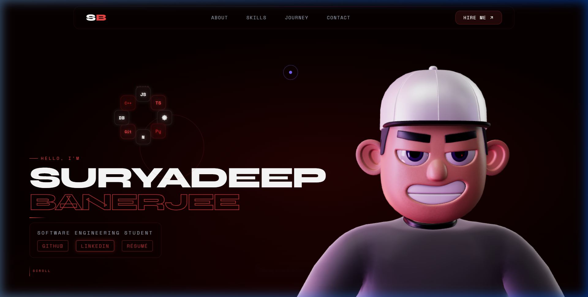
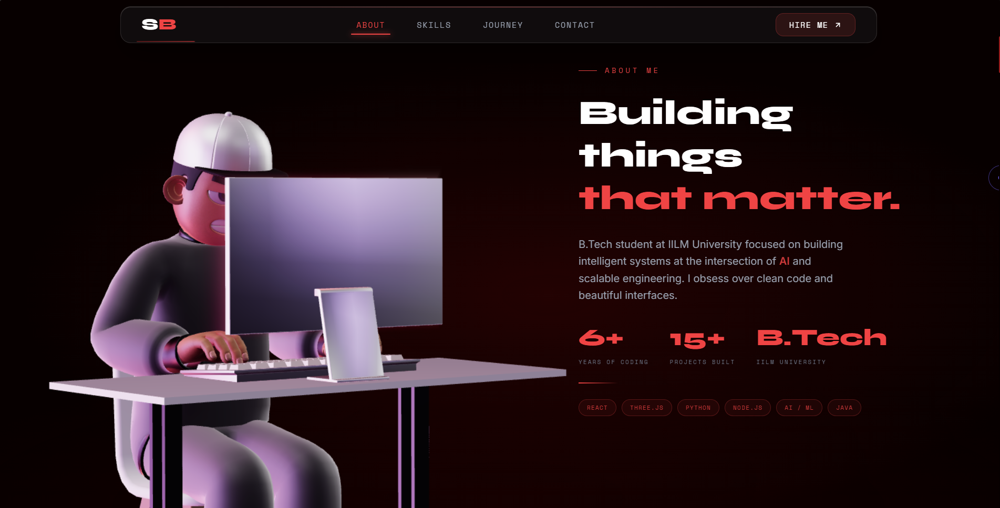
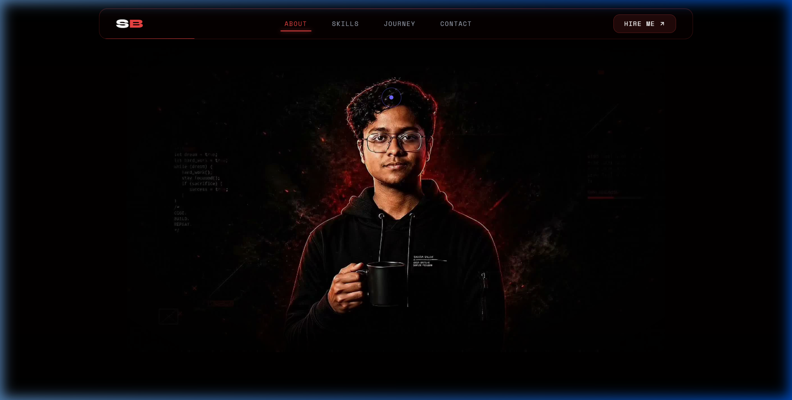
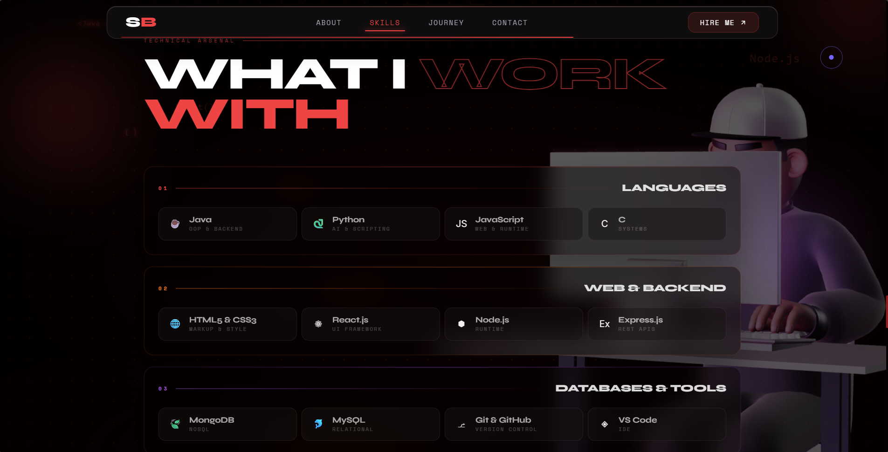
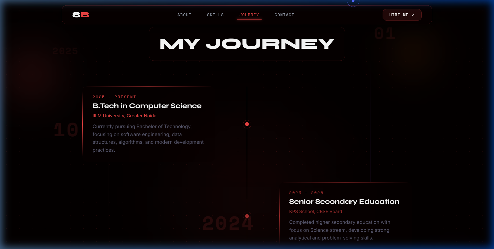
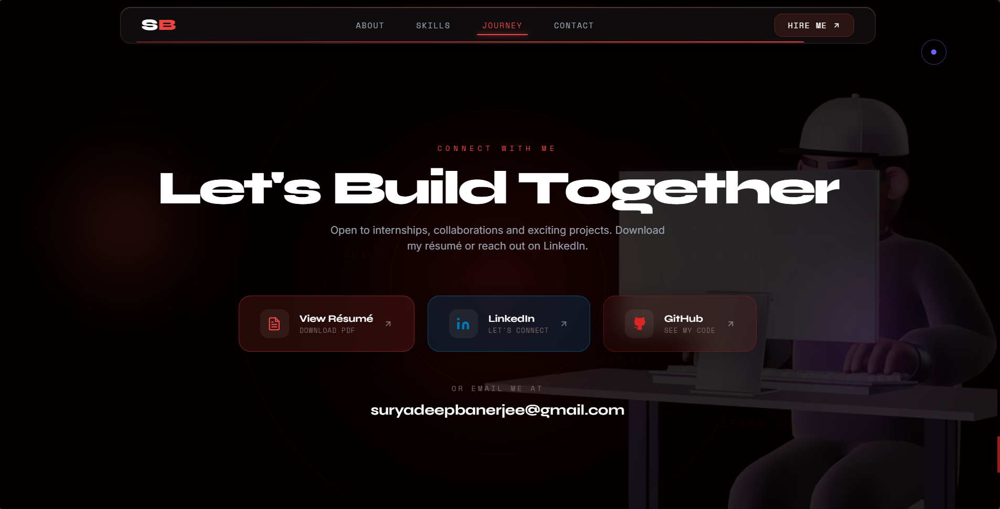
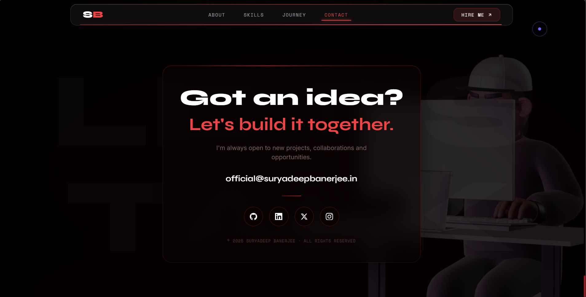

<div align="center">



<br/>

# ✦ SURYADEEP BANERJEE

### Personal Portfolio — `v1.0`

[](https://suryadeepbanerjee.in)
[](https://www.linkedin.com/in/suryadeep-banerjee)
[](https://github.com/suryadeepin)

<br/>

> *A cinematic, dark-mode portfolio built with React + Three.js — featuring a 3D avatar, scroll-synced frame animation, and interactive tech clusters.*

</div>

---

## ✦ Preview

<table>
  <tr>
    <td width="50%">
      
      <p align="center"><sub>🏠 Hero — 3D Avatar + Tech Cluster</sub></p>
    </td>
    <td width="50%">
      
      <p align="center"><sub>👨🏻‍💻 Bio</sub></p>
    </td>
  </tr>
  <tr>
    <td width="50%">
      
      <p align="center"><sub>🎬 Cinematic Scroll — Frame Scrubbing</sub></p>
    </td>
    <td width="50%">
      
      <p align="center"><sub>⚡ Technical Arsenal</sub></p>
    </td>
  </tr>
  <tr>
    <td width="50%">
      
      <p align="center"><sub>📅 Journey & Timeline</sub></p>
    </td>
    <td width="50%">
      
      <p align="center"><sub>📄 Resume & Connect</sub></p>
    </td>
  </tr>
  <tr>
    <td colspan="2" align="center">
      
      <p align="center"><sub>📬 Contact</sub></p>
    </td>
  </tr>
</table>

---

## ✦ Features

- **🎭 Cinematic Intro Loader** — Full-screen branded intro with a GSAP-powered reveal sequence
- **🤖 Interactive 3D Avatar** — Real-time head-tracking that follows the user's cursor, rendered with `@react-three/fiber`
- **🎬 Scroll Frame Scrubbing** — 80 pre-rendered frames animate in sync with the scroll position using a high-performance `requestAnimationFrame` loop
- **⚙️ Tech Icon Cluster** — 8 floating tech icons that scatter on hover with spring physics, then re-cluster
- **⚡ Skills Arsenal** — Categorized tech stack displayed with glassmorphism cards
- **📅 Animated Timeline** — Journey section with scroll-triggered staggered animations
- **📬 Wobbly Email** — Character-by-character hover animation on the email address
- **🖱️ Custom Magnetic Cursor** — Smooth custom cursor with magnetic pull effect on interactive elements
- **🌗 Noir Aesthetic** — Deep blacks, crimson reds, and editorial typography throughout

---

## ✦ Tech Stack

| Category | Technologies |
|---|---|
| **Framework** | React 18, Vite |
| **3D / WebGL** | Three.js, `@react-three/fiber`, `@react-three/drei` |
| **Animation** | GSAP, ScrollTrigger, Lenis (smooth scroll) |
| **Styling** | Vanilla CSS, Google Fonts (Syne, Space Mono, Space Grotesk) |
| **3D Model** | Custom encoded `.glb` avatar with environment HDR lighting |
| **Deployment** | Custom domain — [suryadeepbanerjee.in](https://suryadeepbanerjee.in) |

---

## ✦ Getting Started

### Prerequisites
- Node.js `>=18`
- npm or yarn

### Installation

```bash
# Clone the repository
git clone https://github.com/suryadeepin/Portfolio.git
cd Portfolio

# Install dependencies
npm install

# Start the development server
npm run dev
```

### Build for Production

```bash
npm run build
```

---

## ✦ Project Structure

```
Portfolio/
├── public/
│   ├── hero-video/          # 80 pre-rendered JPEG frames for scroll scrubbing
│   ├── Resume.pdf           # Downloadable résumé
│   ├── avatar.enc           # Encoded 3D avatar model
│   └── logo.png             # Site favicon
├── src/
│   ├── components/
│   │   ├── Hero.jsx         # Hero section with tech cluster & 3D avatar
│   │   ├── HeroAvatar.jsx   # Three.js 3D avatar with head-tracking
│   │   ├── Bio.jsx          # About Me section
│   │   ├── ImageScrub.jsx   # Scroll-synced frame animation
│   │   ├── Skills.jsx       # Technical arsenal section
│   │   ├── Experience.jsx   # Journey timeline
│   │   ├── ResumeSection.jsx
│   │   ├── Contact.jsx      # Contact + social links
│   │   ├── Navbar.jsx
│   │   ├── Loader.jsx       # Cinematic intro loader
│   │   └── CustomCursor.jsx
│   ├── hooks/
│   │   ├── useMagnetic.js   # Magnetic cursor effect hook
│   │   ├── useScramble.js   # Text scramble animation hook
│   │   └── useIsMobile.js   # Mobile detection hook
│   ├── utils/
│   │   ├── preloadFrames.js # Frame preloader for smooth scrubbing
│   │   └── decrypt.js       # Avatar decryption utility
│   └── index.css            # Global styles & design tokens
└── vite.config.js
```

---

## ✦ Connect

<div align="center">

| Platform | Link |
|---|---|
| 🌐 **Website** | [suryadeepbanerjee.in](https://suryadeepbanerjee.in) |
| 💼 **LinkedIn** | [linkedin.com/in/suryadeep-banerjee](https://www.linkedin.com/in/suryadeep-banerjee) |
| 🐙 **GitHub** | [github.com/suryadeepin](https://github.com/suryadeepin) |
| 📧 **Email** | [official@suryadeepbanerjee.in](mailto:official@suryadeepbanerjee.in) |

</div>

---

<div align="center">

<sub>Designed & built by **Suryadeep Banerjee** · © 2025 · All rights reserved</sub>

</div>
